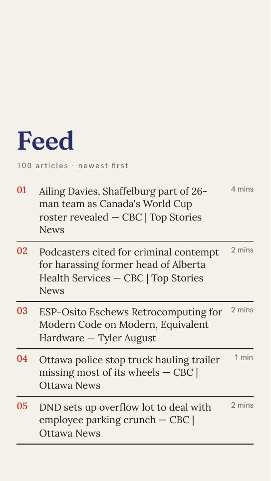
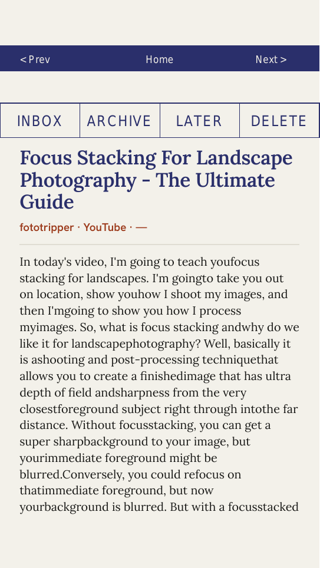
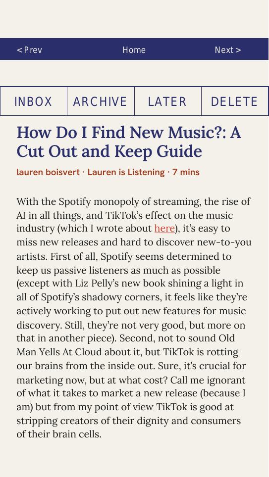

# rmreader

Turn your [Readwise Reader](https://readwise.io/read) library and feed into two
beautiful, hyperlinked, reader-optimized PDFs — and sync them to your reMarkable
Paper Pro, where what you do on the page flows back to Readwise.

rmreader makes a reMarkable a first-class reading device for your Readwise queue.
It pulls your saved articles, renders them as clean editorial PDFs (no ads, no
banners, no tracking junk), uploads them to the reMarkable cloud, and — on the
next sync — reads your on-device highlights and triage decisions back out and
applies them to Readwise.

<p align="center">
  
  &nbsp;
  
  &nbsp;
  
</p>

<p align="center"><em>Left: the index hub. Center & right: article pages with the
tappable nav bar (Home / Prev / Next) and the highlightable <code>INBOX · ARCHIVE ·
LATER · DELETE</code> action band.</em></p>

## Why

reMarkable is a wonderful surface for reading and marking up long text, but
getting your reading queue *onto* it — and getting your reactions back *off* it —
is tedious. rmreader closes that loop:

- **Read on the device, not in a browser.** Your whole Library and Feed become two
  self-contained PDFs with full article text, so there's nothing to tap through to
  and no network required once they're on the device.
- **Triage with a highlighter.** Highlight the `ARCHIVE` label at the top of an
  article and it gets archived in Readwise on the next sync. Same for `INBOX`,
  `LATER`, and `DELETE`.
- **Highlights go home.** Anything you highlight in the body is pushed back to
  Readwise as a highlight on that document.
- **It's idempotent.** Every sync replaces the on-device document with a fresh,
  un-annotated copy, so each run only ever sees *new* marks.

## What it produces

Two PDFs — `Library.pdf` and `Feed.pdf` — each a three-tier hyperlinked document:

1. **Index** — a typographic table of contents, one row per item (title, author,
   reading time), newest first. Tap a row to jump to that article.
2. **Articles** — the full, de-cluttered reader text of every item, each starting
   on a fresh page, with a tappable nav bar (Home / Prev / Next) and the
   highlightable action band repeated on every page so you can triage from
   anywhere.
3. **Native bookmarks** — the PDF outline populates the reMarkable's navigation
   panel, giving a device-wide table of contents from any page.

Typography is tuned for e-ink reading: the **Newsreader** optical serif for body
and display, **Hanken Grotesk** for navigation and metadata, generous measure and
line-height, and editorial touches (uppercase kickers, hairline rules, ink-red
links). Content images are kept in color for the Paper Pro's color e-ink display.

## How it works

```
Readwise Reader API  ──fetch──▶  clean HTML  ──fulgur (HTML→PDF)──▶  Library.pdf / Feed.pdf
                                                                          │
                                                                  rmapi put │ (reMarkable cloud)
                                                                          ▼
                                                                   reMarkable Paper Pro
                                                                  (read · highlight · triage)
                                                                          │
                                                            rmapi get │ next sync
                                                                          ▼
        Readwise  ◀──archive / later / delete / highlights──  read back highlighter strokes
```

- **HTML→PDF with no browser.** Rendering uses [fulgur](https://crates.io/crates/fulgur)
  (Blitz + krilla), so there's no headless Chromium — just a fast, deterministic
  Rust pipeline with embedded fonts.
- **The PDF is the single source of truth.** rmreader embeds a manifest (page →
  Readwise document map, plus the action-label positions) inside the generated PDF.
  reMarkable returns the source PDF unchanged on download, so the bundle is
  self-describing — there's no local state to keep in sync.
- **Read-back is geometric.** The Paper Pro stores highlights as highlighter *ink
  strokes*, not selected text. rmreader maps those strokes from device space into
  PDF points, checks which land on an action label, and reconstructs highlighted
  body text from the PDF's own text layer (`pdftotext -bbox`). reMarkable file
  parsing lives in the sibling [`rmfiles`](../rmfiles) crate.

## Install

rmreader is a Rust CLI. The easiest path is Nix (a `flake.nix` is provided):

```sh
nix build              # builds the rmreader binary into ./result/bin
# or, for development:
nix develop -c cargo build --release
```

The dev shell brings its own toolchain plus the runtime tools rmreader shells out
to — [`rmapi`](https://github.com/ddvk/rmapi) for reMarkable cloud sync and
`poppler-utils` for the PDF text layer. Without Nix you'll need a recent Rust
toolchain and those tools on your `PATH`.

## Usage

**First run — interactive setup:**

```sh
rmreader init
```

The wizard asks for your device, an output directory, your Readwise access token
(from [readwise.io/access_token](https://readwise.io/access_token) — it validates
it for you), how many items to include, and where to put the PDFs in your
reMarkable cloud. It writes an `rmreader.toml` and does a full generate + upload.

**Every run after that — sync:**

```sh
rmreader path/to/rmreader.toml
```

This reads back your on-device highlights and triage, applies them to Readwise,
regenerates fresh PDFs from the post-action state, and re-uploads them.

Run it on a schedule (cron, a systemd timer, etc.) and your reMarkable stays in
step with your Readwise queue.

### Configuration

`rmreader.toml` lives beside the output. Because it holds your Readwise token it is
gitignored by default.

```toml
device = "paper-pro-move"          # or "paper-pro"
output_dir = "."                   # where PDFs + manifests are written
theme = "reader"

[readwise]
token = "..."                      # from readwise.io/access_token

[library]
locations = ["new", "later", "shortlist"]
max_items = 100

[feed]
enabled = true
max_items = 100

[images]
enabled = true                     # fetch + embed content images (color)

[deploy]
backend = "rmapi"                  # or "none" to just write PDFs locally
library_folder = "/Readwise"       # reMarkable cloud folder for Library.pdf
feed_folder = "/Readwise"          # reMarkable cloud folder for Feed.pdf
```

Set `backend = "none"` to generate the PDFs on disk without touching the
reMarkable cloud — handy for trying it out.

## Triage from the device

Every article page carries a band of real text labels just below the nav bar:

```
INBOX     ARCHIVE     LATER     DELETE
```

Highlight one with the reMarkable highlighter and, on the next sync, rmreader:

- moves the document to that location in Readwise (`INBOX` → new, `ARCHIVE`,
  `LATER`, or deletes it for `DELETE`);
- pushes any text you highlighted in the article body to Readwise as a highlight
  on that document.

Highlight two different action labels on the same article and rmreader skips the
action and warns rather than guessing — your body highlights still go through.

## Supported devices

| Device                    | Resolution (portrait) | PPI |
|---------------------------|-----------------------|-----|
| reMarkable Paper Pro Move | 954 × 1696            | 264 |
| reMarkable Paper Pro      | 1620 × 2160           | 229 |

Both are color e-ink, so images are rendered in color.

## Development

```sh
make test           # cargo test in the nix dev shell
make clippy         # cargo clippy -D warnings
make fmt-check      # rustfmt check
make build          # nix build
make hooks          # enable the pre-commit fmt hook (once per clone)
```

The codebase has no manual test steps — the Readwise client, content pipeline, PDF
assembly, manifest round-trip, read-back classification, and deploy command
sequences are all unit-tested (the Readwise/rmapi boundaries use injectable
transports so they're tested against fakes). Layout is guarded by golden-image
visual-regression tests; regenerate them with `make update-goldens` after an
intentional design change.

## Project layout

```
src/
  cli.rs            init wizard | regenerate-and-sync from a config
  config.rs         TOML config + validate()
  readwise/         Reader API client (list, location change, delete, highlights)
  content.rs        sanitize HTML, fetch/transcode/rewrite images
  assemble.rs       build the three-tier HTML document
  render.rs         fulgur render: reader CSS, embedded fonts, bookmarks
  postprocess.rs    stamp nav bar + action band, embed the manifest
  embed.rs          write/read the PDF-embedded manifest
  readback/         strokes → coords → text layer → classify → Readwise plan
  deploy/           rmapi (cloud) and none (local) backends
  generate.rs       orchestration
themes/             reader.toml — the "Newsprint" palette
assets/fonts/       embedded TTFs (Newsreader, Hanken Grotesk, …)
docs/superpowers/   design specs, plans, and spike notes
```

reMarkable file-format parsing (`.rmdoc` bundles, v6 `.rm` scene blocks) lives in
the standalone, reusable [`rmfiles`](../rmfiles) crate.

## License

MIT — see [LICENSE](LICENSE).
